## Task 1: 

1. On the Lab VM, click on **Visual Studio Code**.

   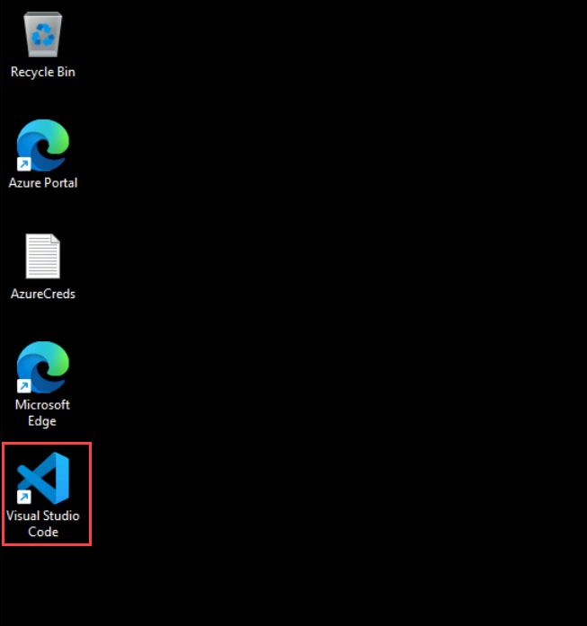

1. Click the **More Actions (⋯) (1)**, select **Terminal** **(2)**, and then click **New Terminal** **(3)** to open a new integrated terminal.

      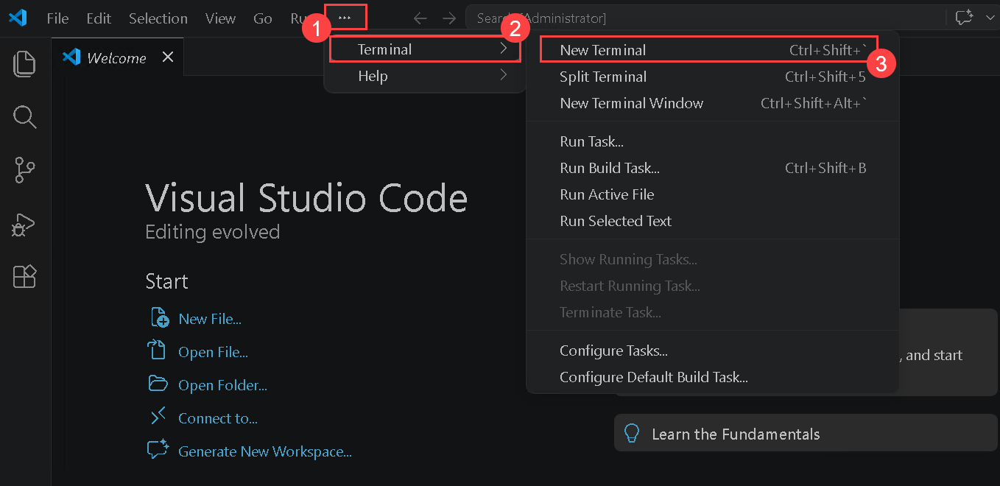

1. Clone the repository by running the following command:

   ```bash
   git clone "https://github.com/CloudLabsAI-Azure/Dynamo_on_AKS"
   ```

   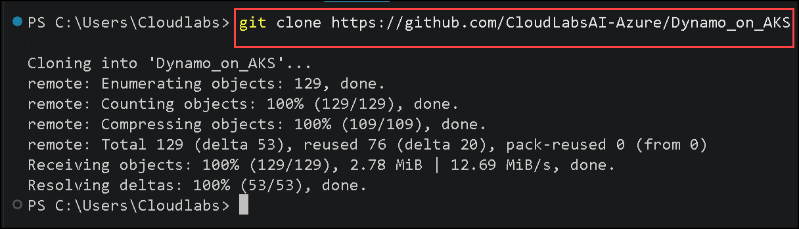

1. Once after cloning the repository successfully, lets open the folder **(2)** in the **Explorer(1)**.

   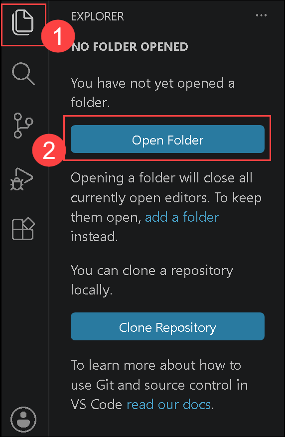

1. Click **OneDrive** **(1)**, select the **Dynamo_on_AKS** folder **(2)**, and then click **Select Folder** **(3)** to open the repository in Visual Studio Code.

    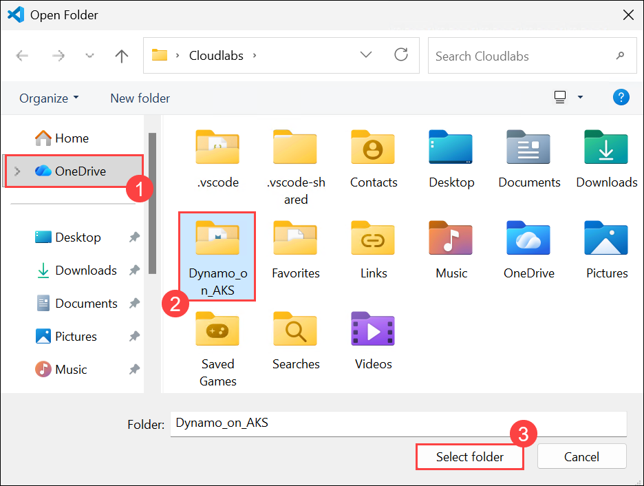

1. Once after opening the folder, you should see a restricted warning on the above click on **Manage(1)**, a workspace trust wizard opens up then select **Trust (2)**, to trust the authors of the folder and click on **X (3)** to close the wizard.

   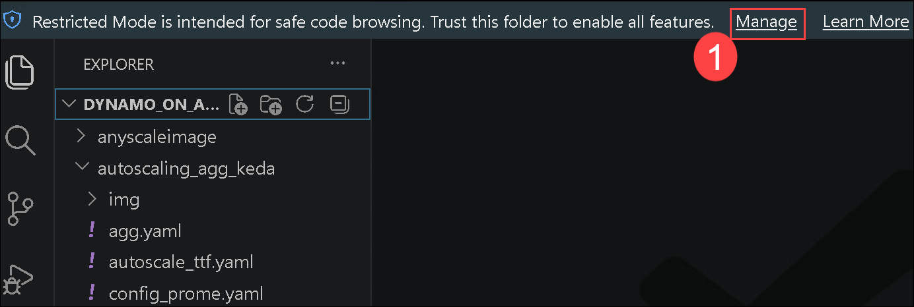

   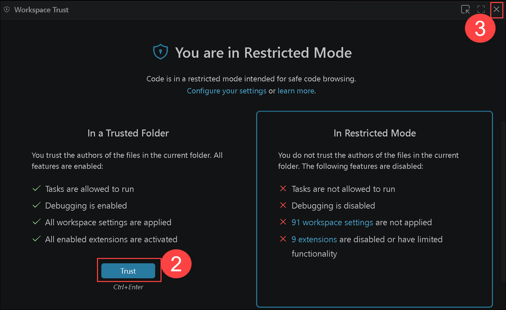

1. In the Explorer pane, expand the **DYNAMO_ON_AKS**  **(1)**, open the **autoscaling_agg_keda** folder **(2)**, and then select the **dynamo-keda.ipynb** notebook file **(3)**.

   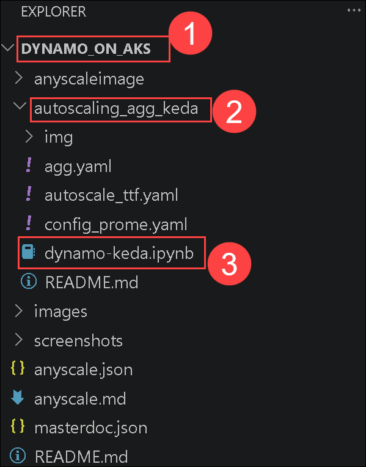

1. Now lets setup the Python kernel in order to run the notebook, one the notebook file click on **Select Kernel (1)** and then select **Install/Enable suggested extensions (2)**.

   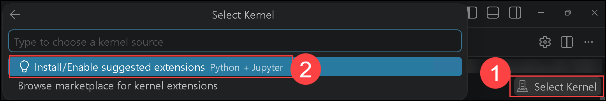

1. Then select **Python Environments (1)**. Once after the necessary python version is installed, click on the version that is installed **(2)**.

   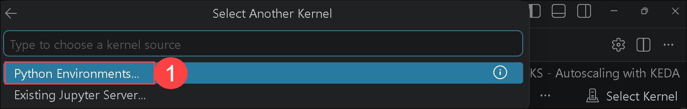

   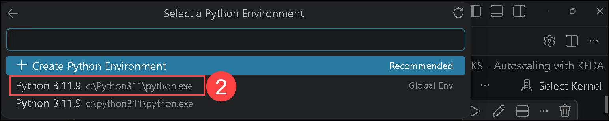

   > **Note:** While doing this if you recieve any popup to ipykernel packages click on **install**.

      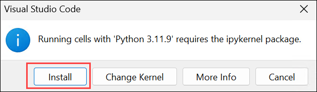

1. Before we start the setting up the environment lets login to the azure account by running the first cell `!az login`. It will ask you for providing the credentials to login please follow the below proceedure.

   - Minimize the VS code to see any Sigin popup wizard then select **Work or school account (1)** and click on **Continue(2)**.

      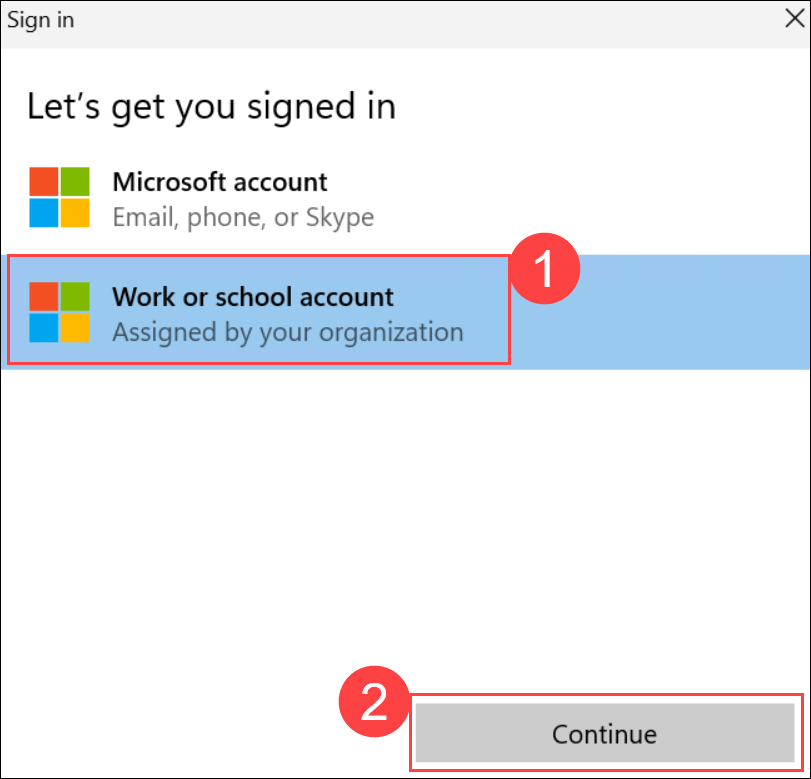

   - On the **Sign in** tab, enter the following **Email/Username:** <inject key="AzureAdUserEmail"></inject> **(1)**, and click on **Next (2)**. 

      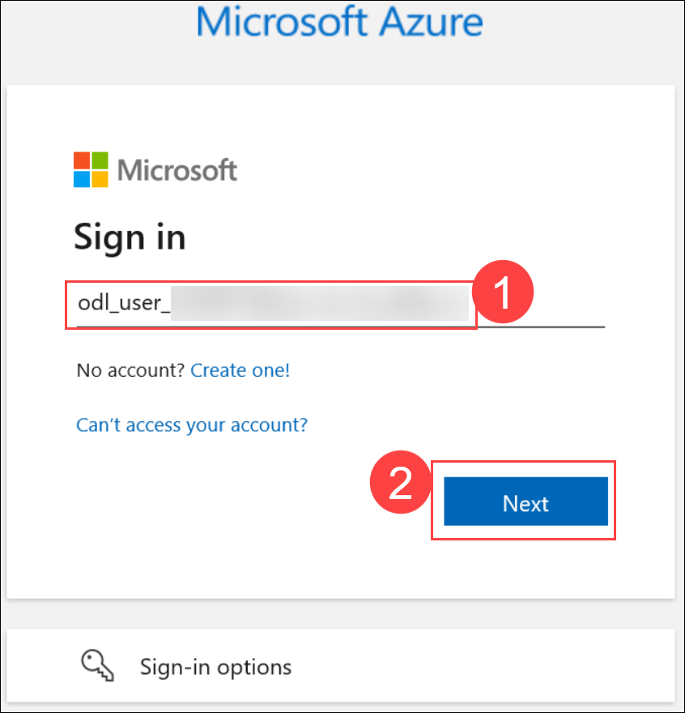
   
   - Now enter the following **Temporary Access Pass:** <inject key="AzureAdUserPassword"></inject> **(1)** and click on **Sign in (2)**.

     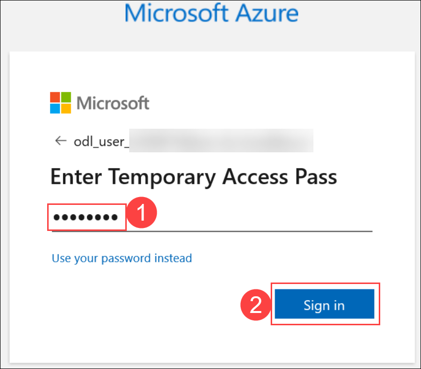
   
   - On **Signin to all apps and websites on this device** click on **Yes**.

      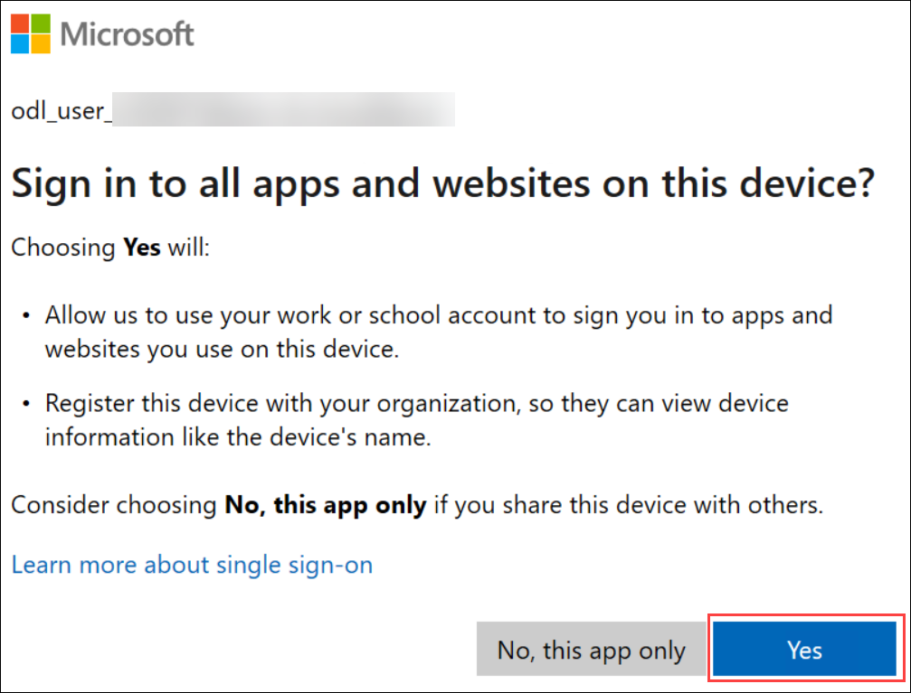

   - Once after the successfull login, cell execution should show you the login details such as tenant ID, tenant name, subscription ID/name.

      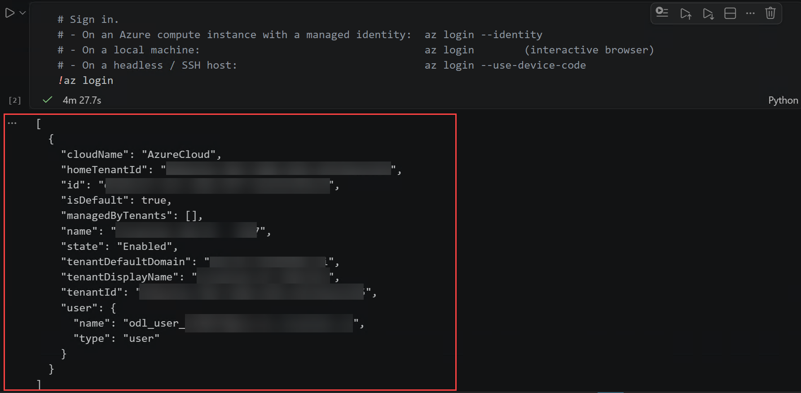

1. In the **Environment Configuration** section, update the **CLUSTER_NAME** value by replacing **XXXXXX** **(1)** with a value that you see from **Azure Portal** and then click the **Run Cell** button **(2)** to execute the configuration cell.

   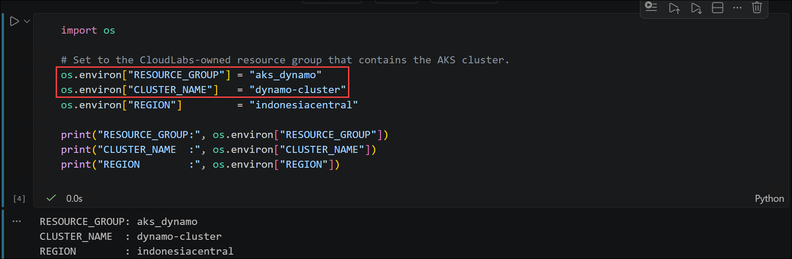

1. Now, let's run the next cell to confirm that the AKS cluster is available under the active Azure subscription. Click the **Run Cell** button to execute to show the output should display the cluster details, indicating that the cluster is ready for the subsequent deployment steps.

   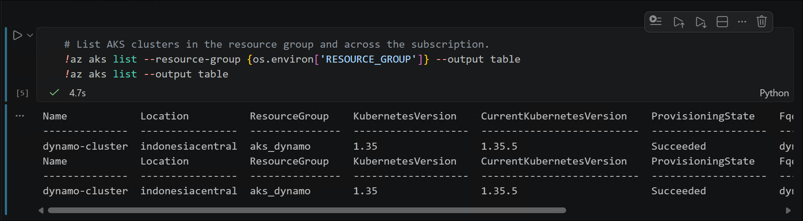

1. Now, let's run the next cell to view the details of the AKS node pools associated with your cluster. Click the **Run Cell** button to execute to verify the node pool configuration, including the node count, virtual machine size, autoscaler minimum and maximum node limits, and availability zones, to ensure the cluster is configured as expected before proceeding with the lab.

   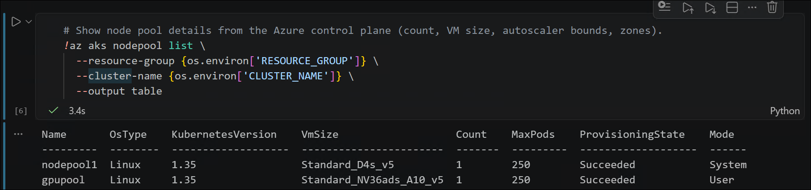
   

1. Now, let's click on the **Run Cell** button to execute to retrieve the credentials for your AKS cluster. This command merges the cluster configuration into your local Kubernetes configuration (~/.kube/config), allowing kubectl to communicate with the cluster in the subsequent steps.

   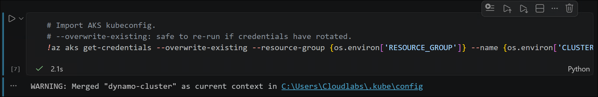

1. Now, let's run the next cell to verify that all AKS nodes are in the Ready state. Click the **Run Cell** button to execute to confirm that both the system node pool and the GPU node pool are listed, and verify that the GPU nodes are associated with the gpupool node pool before proceeding with the lab.

   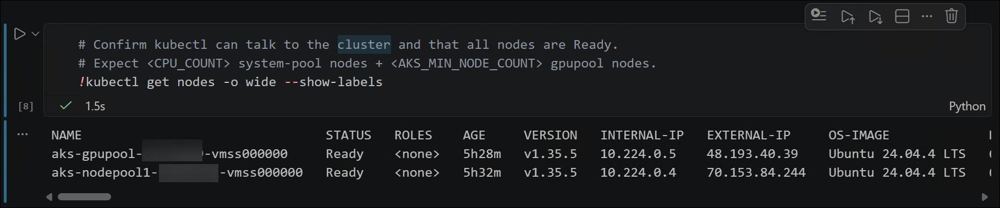

1. Now, let's run the next cell to install **kubectl** if it is not already available in your environment. This ensures that the Kubernetes command-line tool is installed and ready to interact with your AKS cluster in the subsequent lab steps, particularly when using Azure Cloud Shell or a Linux virtual machine.

   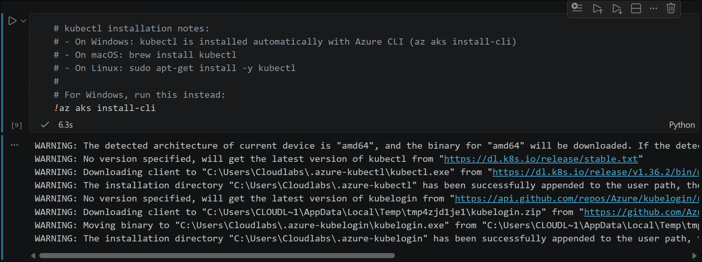

> See [autoscaling_agg_keda/dynamo-keda.ipynb](./autoscaling_agg_keda/dynamo-keda.ipynb) for the full step-by-step guide.


