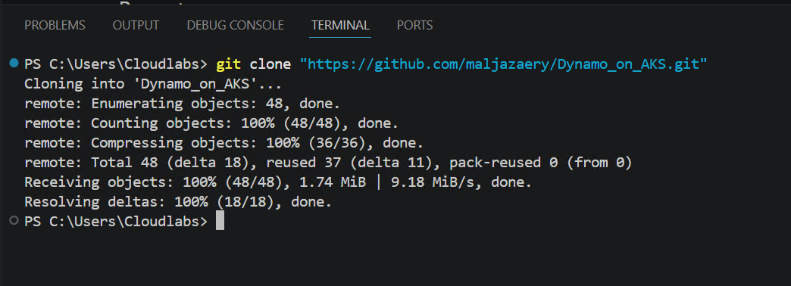
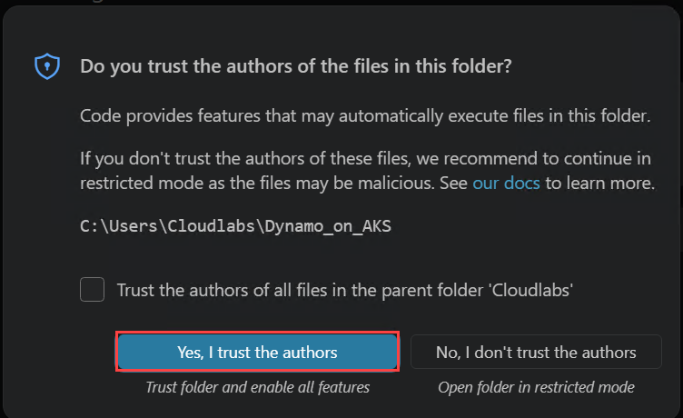
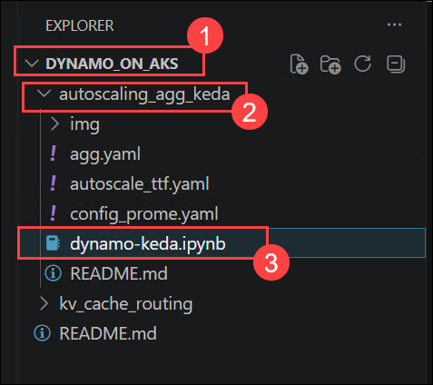
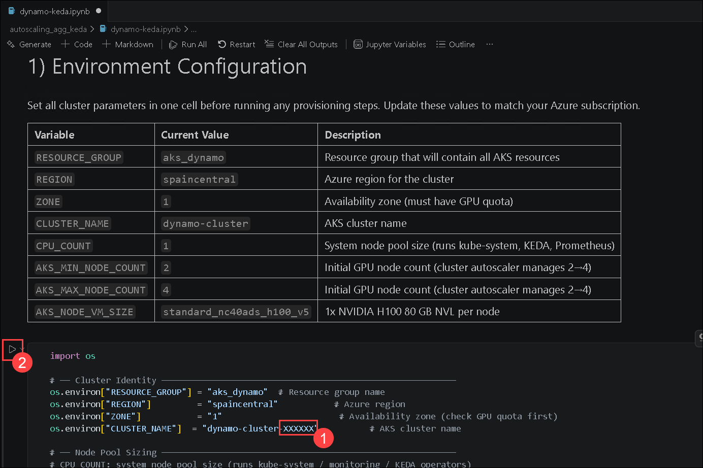
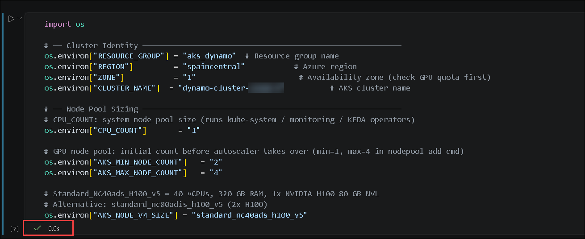
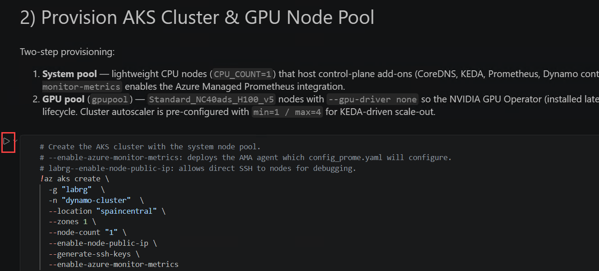
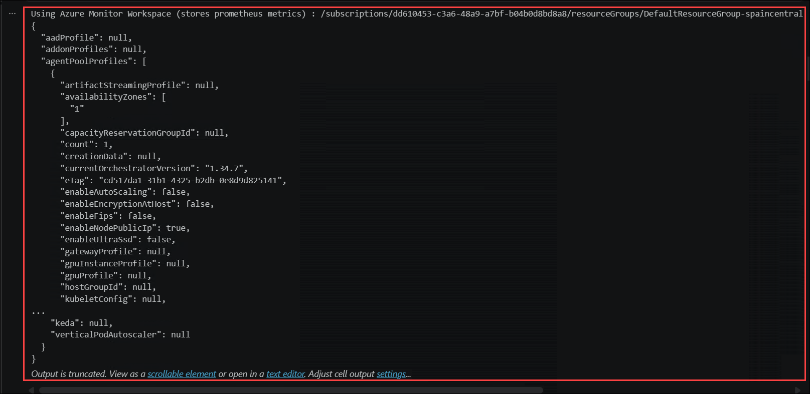
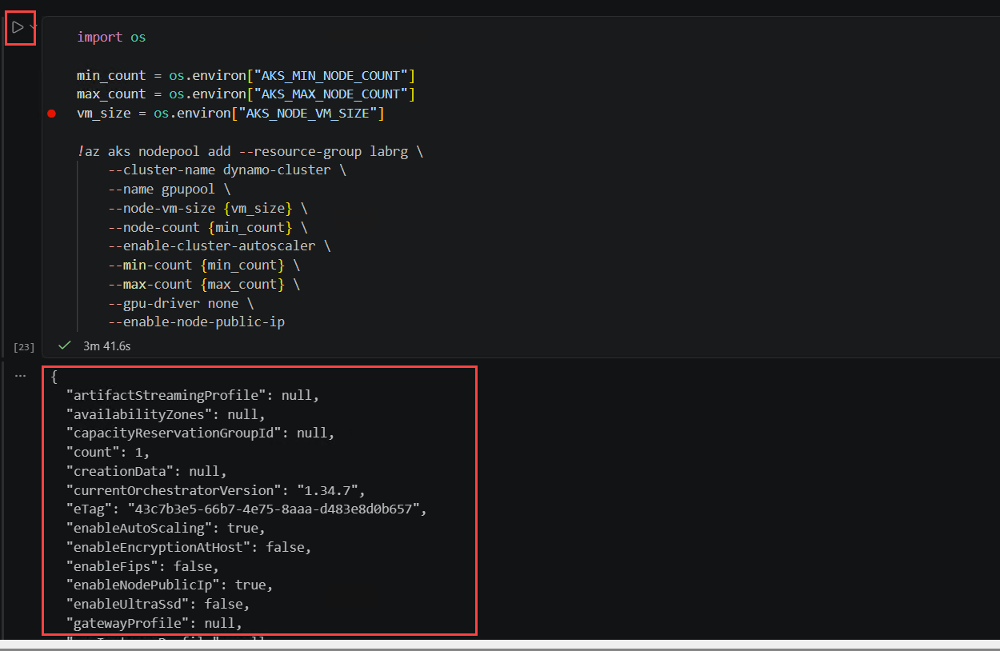

# Dynamo On AKS

End-to-end tutorials for running [NVIDIA Dynamo](https://github.com/ai-dynamo/dynamo) on **Azure Kubernetes Service (AKS)**, integrated with **Azure Managed Prometheus** and **Grafana**, showcasing different inference serving architectures and autoscaling strategies for LLM workloads.


## Getting Started with the lab

Welcome to your **Dynamo on AKS** workshop. Let's begin by making the most of this experience.

## Virtual Machine & Lab Guide

Your virtual machine is your workhorse throughout the workshop. The lab guide is your roadmap to success.

## Accessing Your Lab Environment

Once you're ready to dive in, your virtual machine and **Guide** will be right at your fingertips within your web browser.


## Lab Guide Zoom In/Zoom Out

To adjust the zoom level for the environment page, click the **A↕ : 100%** icon located next to the timer in the lab environment.


## Exploring Your Lab Resources

To get a better understanding of your lab resources and credentials, navigate to the **Environment** tab.


## Utilizing the Split Window Feature

For convenience, you can open the lab guide in a separate window by selecting the **Split Window** button from the Top right corner.


## Managing Your Virtual Machine

Feel free to **Start, Stop, or Restart (2)** your virtual machine as needed from the **Resources (1)** tab. Your experience is in your hands!


## Let's Get Started with Azure Portal

1. On your virtual machine, click on the Azure Portal icon.

2. You'll see the **Sign into Microsoft Azure** tab. Here, enter your **credentials (1)** and select **Next (2)**:

   - **Email/Username:** <inject key="AzureAdUserEmail"></inject>

     

3. Next, provide your **Temporary Access pass (1)**, enter the password and select **Sign In (2)**:

    - Enter **Temporary Access Pass:** <inject key="AzureAdUserPassword"></inject> **(1)**

      

4. If **Action required** pop-up window appears, click on **Ask later**.
5. If prompted to **stay signed in**, you can click **No**.
6. If a **Welcome to Microsoft Azure** pop-up window appears, simply click **"Cancel"** to skip the tour.


---

## Overview

| # | tutorial | Description | Status |
|---|------|----------|--------|
| 1 | [Autoscaling Aggregated Serving with KEDA](#1-autoscaling-aggregated-serving-with-keda) | Metric-driven HPA via KEDA + Prometheus TTFT | ✅ Complete |
| 2 | [Autoscaling Disaggregated Serving with Dynamo Planner](#2-autoscaling-disaggregated-serving-with-dynamo-planner) | Disaggregated Prefill/Decode with Dynamo planner | 🚧 In Progress |
| 3 | [KV Cache Routing](#3-kv-cache-routing) | Intelligent KV cache-aware request routing | 🚧 In Progress |

---

## Architecture

All demos share a common base infrastructure on Azure:

```
┌─────────────────────────────────────────────────────────┐
│                    Azure AKS Cluster                    │
│                                                         │
│  ┌──────────────────────────────────────────────────┐   │
│  │                                                  │   │
│  │                 Dynamo operator                  │   │
│  └──────────────────────────────────────────────────┘   │
│                                                         │
│  ┌──────────────────────────────────────────────────┐   │
│  │      Azure GPU Node Pool (ND / NC / NV)          │   │
│  │   Frontend pods  →  Prefill / Decode Workers     │   │
│  └──────────────────────────────────────────────────┘   │
└─────────────────────────────────────────────────────────┘
         │                          │
         ▼                          ▼
┌─────────────────┐      ┌──────────────────────┐
│  Azure Managed  │      │   Azure Managed      │
│  Prometheus     │────▶ │   Grafana            │
└─────────────────┘      └──────────────────────┘
```


## Demos

### 1. Autoscaling Aggregated Serving with KEDA

**Folder:** [`autoscaling_agg_keda/`](./autoscaling_agg_keda/)

**What it demonstrates:**

Deploys Dynamo in **aggregated serving** mode (combined Prefill + Decode per pod) and autoscales the number of Worker replicas using **KEDA** triggered by **Time-to-First-Token (TTFT)** latency sourced from Prometheus.

**Architecture:**

```
Client → LoadBalancer :8000
           └─ Frontend pods ×2
                   └─ VllmDecodeWorker pods ×2–4  (autoscaled)
```

**Autoscaling Signal:**


When **TTFT p95 > 300 ms**, KEDA scales up Decode Workers from **2 → 4** replicas. Scale-down cooldown is 120 s.

## Task 1: 

1. From the Lab VM, select **Visual Studio Code
        

1. Click the **More Actions (⋯) (1)**, select **Terminal** **(2)**, and then click **New Terminal** **(3)** to open a new integrated terminal.
        

1. Clone the repository by running the following command:

   ```bash
   git clone "https://github.com/maljazaery/Dynamo_on_AKS.git"
   ```

   

1. Click **OneDrive** **(1)**, select the **Dynamo_on_AKS** folder **(2)**, and then click **Select Folder** **(3)** to open the repository in Visual Studio Code.

    

1. When prompted, select **Yes, I trust the authors**.
        

1. In the Explorer pane, expand the **DYNAMO_ON_AKS**  **(1)**, open the **autoscaling_agg_keda** folder **(2)**, and then select the **dynamo-keda.ipynb** notebook file **(3)**.

   

1. In the **Environment Configuration** section, update the **CLUSTER_NAME** value by replacing **XXXXXX** **(1)** with a **Cloud DID**, and then click the **Run Cell** button **(2)** to execute the configuration cell.

   

1. Verify that the configuration cell has executed successfully by confirming that a green check mark and execution status are displayed at the bottom of the cell.

   

1. In the **Provision AKS Cluster & GPU Node Pool** section, click the **Run Cell** button to execute the AKS cluster provisioning command and create the system node pool.

   

1. After the command completes, verify that the AKS cluster was created successfully by reviewing the JSON output, which should resemble the output shown below.

   

1. Click the **Run Cell** button to execute the GPU node pool provisioning command, and verify that the operation completes successfully by confirming that the output displays the node pool configuration details in JSON format, similar to the output shown below.

   


> See [autoscaling_agg_keda/dynamo-keda.ipynb](./autoscaling_agg_keda/dynamo-keda.ipynb) for the full step-by-step guide.


## Contributing

Contributions and issue reports are welcome. Please open a GitHub Issue or Pull Request.

## Support Contact

The CloudLabs support team is available 24/7, 365 days a year, via email and live chat to ensure seamless assistance at any time. We offer dedicated support channels tailored specifically for both learners and instructors, ensuring that all your needs are promptly and efficiently addressed.

Learner Support Contacts:

- Email Support: [cloudlabs-support@spektrasystems.com](mailto:cloudlabs-support@spektrasystems.com)
- Live Chat Support: https://cloudlabs.ai/labs-support

Click **Next** from the bottom right corner to embark on your Lab journey!


Now you're all set to explore the powerful world of technology. Feel free to reach out if you have any questions along the way. Enjoy your workshop!

---