# Getting Started with Anyscale on Azure

## Overview

Welcome to the Anyscale on Azure lab environment. In this guide, you will:

- Access the Anyscale  Console
- Sign in using your lab account
- Launch your first workspace
- Connect to GPU compute (H100/G100)
- Validate your environment

## Getting Started with the lab

Welcome to your **Anyscale on Azure** workshop. Let's begin by making the most of this experience.

## Virtual Machine & Lab Guide

Your virtual machine is your workhorse throughout the workshop. The lab guide is your roadmap to success.

## Accessing Your Lab Environment

Once you're ready to dive in, your virtual machine and **Guide** will be right at your fingertips within your web browser.

## Lab Guide Zoom In/Zoom Out

To adjust the zoom level for the environment page, click the **A↕ : 100%** icon located next to the timer in the lab environment.

## Utilizing the Split Window Feature

For convenience, you can open the lab guide in a separate window by selecting the **Split Window** button from the Top right corner.

# Prerequisites

Before starting this lab, ensure you have the following credentials available from the **Environment** tab in your CloudLabs portal:

| Variable | Description | Value |
|---|---|---|
| `AzureAdUserEmail` | Your Azure / Anyscale login email | <inject key="AzureAdUserEmail"></inject> |
| `AzureAdUserPassword` | Your Azure / Anyscale login password | <inject key="AzureAdUserPassword"></inject> |
| `AnyscaleHost` | Anyscale console URL (`https://console.anyscale.com`) | <inject key="AnyscaleHost"></inject> |

---

# Step 1: Log in to the Anyscale Console

1. Open your browser and navigate to **[https://console.anyscale.com](https://console.anyscale.com)**.

2. On the login page, enter your **email address** in the email field and click **Continue** (do **not** use any third-party SSO buttons):
   - **Email**: <inject key="AzureAdUserEmail"></inject>

   

3. Anyscale sends a **one-time passcode (OTP)** to your mailbox. Keep this Anyscale tab open — you will return to it after retrieving the code.

4. Open a **new browser tab** and go to **[https://outlook.office.com](https://outlook.office.com)**. Sign in with your lab credentials to open your mailbox:
   - **Email**: <inject key="AzureAdUserEmail"></inject>
   - **Password**: <inject key="AzureAdUserPassword"></inject>

   

5. In the inbox, open the latest email from **Anyscale** and copy the **verification code (OTP)**.

   

6. Switch back to the **Anyscale** tab, paste the **OTP** into the verification field, and click **Continue** to complete sign-in.

   

7. After successful verification, you will be redirected to the Anyscale **Home** page displaying a welcome message.

   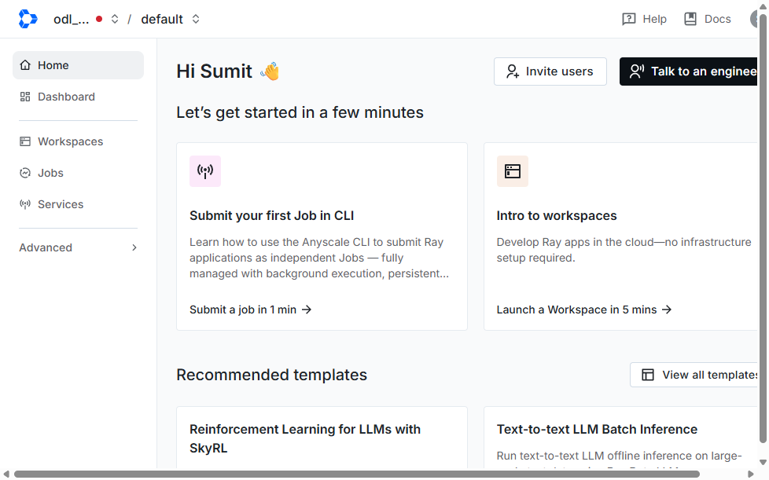

   > You should see **"Hi \<Your Name\>"** along with quick-start cards for submitting jobs and launching workspaces.

---

# Step 2: Navigate to Your Cloud

Your lab environment is pre-configured with a dedicated Anyscale Cloud backed by an Azure AKS cluster with GPU nodes.

1. In the **top navigation bar**, click on the **cloud name** dropdown (shown in the breadcrumb area at the top-left, e.g. `odl_user_XXXXXX_cloud`).

2. A dropdown menu will appear listing all available clouds under your organization. Select your assigned cloud.

   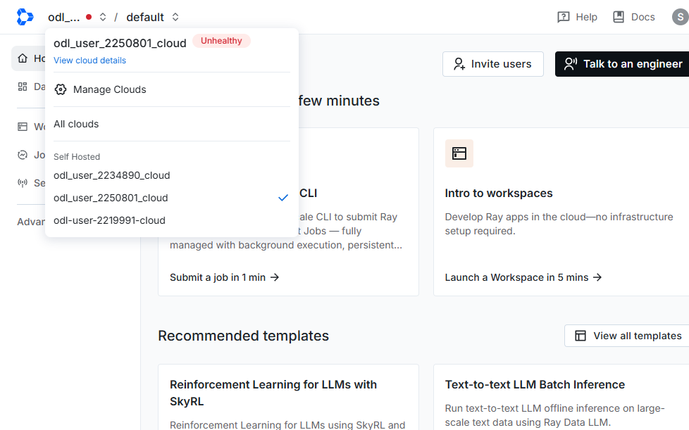

   > Each cloud is a self-hosted Kubernetes environment. Your cloud name follows the pattern `odl_user_<LabId>_cloud`.

3. Alternatively, you can view all clouds by clicking the **user avatar** (top-right) and selecting **Clouds** from the menu.

   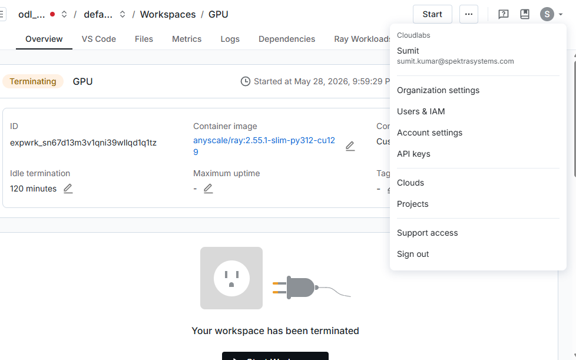

4. The **Clouds** management page shows all registered clouds, their IDs, deployment dates, and hosting type.

   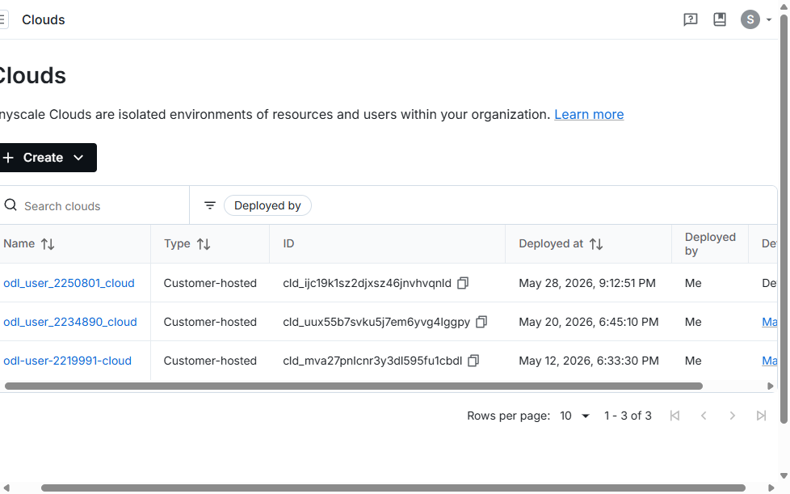

---

# Step 3: Select a Workspace

Workspaces are interactive development environments where you can build and debug Ray applications on GPU clusters.

1. After selecting your cloud, click **Workspaces** in the left sidebar navigation.

   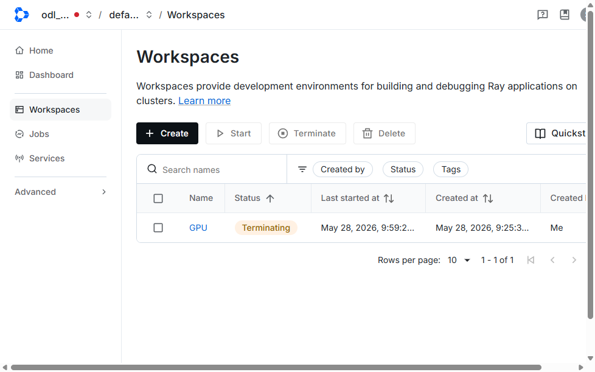

2. The Workspaces page shows all workspaces in the selected cloud and project. You can:
   - **Create** a new workspace using the `+ Create` button
   - **Start** a terminated workspace by selecting it and clicking `Start`
   - **Search** for workspaces by name
   - **Filter** by status, creator, or tags

3. Click on a workspace name (e.g. **GPU**) to open its detail view.

   

4. The workspace detail page shows:
   - **Status**: Running, Terminating, or Terminated
   - **Container image**: The Ray version and Python environment
   - **Compute configuration**: GPU/CPU resources allocated
   - **Tabs**: Overview, VS Code, Files, Metrics, Logs, Dependencies, Ray Workloads

---

# Step 4: Launch and Use a Workspace

1. If your workspace is in **Terminated** state, click the **Start** button to launch it.

2. Once the workspace is **Running**, you can access it via:
   - **VS Code tab**: Opens a browser-based VS Code editor connected to the workspace
   - **Terminal tab**: Provides a web terminal for running commands
   - **JupyterLab**: Available at the workspace URL for notebook-based development

3. The workspace runs on an AKS cluster with:
   - **Head node**: CPU-based node for orchestration
   - **Worker nodes**: GPU nodes (H100) for compute-intensive tasks
   - Automatic scaling based on workload demands

---

# Step 5 — Monitor Service Metrics and Health

Once your service is deployed and running, use the built-in observability tools to
monitor request traffic, latency, resource utilization, and overall health. Anyscale
exposes two complementary views:

- The **Metrics** tab — curated dashboards for the service, cluster, and LLM workers.
- The **Ray Dashboard** — low-level Ray Serve deployment status, metrics, and logs.

> Tip: Use the time-range selector (e.g. **Last 30 mins**) in the top-right corner to
> widen or narrow the window, and **View tab in Grafana** to open the underlying
> dashboards for deeper analysis or custom alerting.

## 5.1 — Open the Metrics Tab (Service view)

From your service's top navigation bar, select **Metrics**, then the **Service** sub-tab.

Review the **Service version metrics** and **Service metrics** panels:

- **QPS per version** — request throughput for each deployed version.
- **Error QPS per version** — rate of failed requests.
- **P90 latency per version** — 90th-percentile response latency.
- **Num replicas per version** — replicas currently serving each version.
- **Cluster Utilization** — GRAM and Memory (RAM) usage across the cluster.
- **QPS per application** — throughput broken down by application.

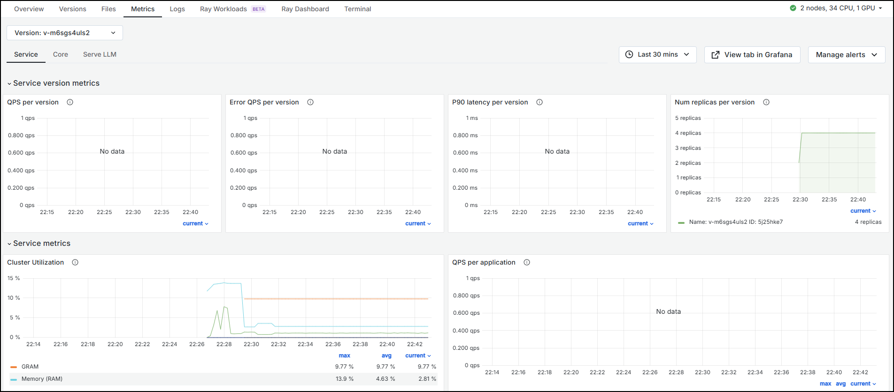

## 5.2 — Inspect Core Cluster Metrics

Select the **Core** sub-tab to view the **Overview and Health** of the underlying Ray
cluster:

- **Node Count** — active nodes by type (e.g. head-node and `1xA10GB:34CPU-288GB`).
- **Workload Instances** — instance IDs, node IDs, and IP addresses.
- **Ray OOM Kills (Tasks and Actors)** — out-of-memory failures (none expected in a
  healthy run).
- **Cluster Utilization** and **Hardware Utilization by Node** — GRAM / RAM trends.

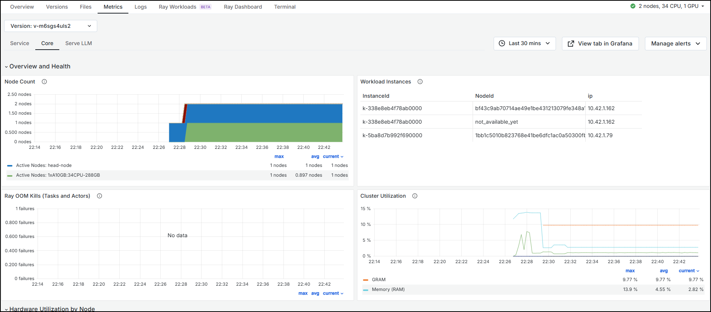

## 5.3 — Review Serve LLM (vLLM) Metrics

Select the **Serve LLM** sub-tab for vLLM-specific performance metrics:

- **QPS per vLLM worker** — per-worker request rate.
- **vLLM: Time Per Output Token Latency** and **Time To First Token Latency**.
- **vLLM: Token Throughput** — tokens generated per second.
- **vLLM: Cache Utilization** and **KV Cache Hit Rate** — KV-cache efficiency.

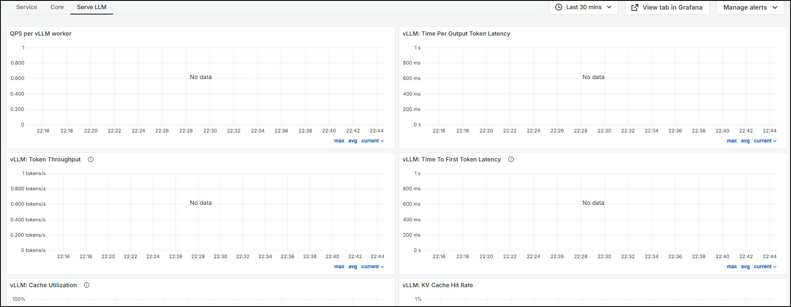

## 5.4 — Open the Ray Dashboard (Serve)

From the top navigation bar, select **Ray Dashboard**, then the **Serve** tab to confirm
your deployments are healthy:

- **Controller status**, **Proxy status**, and **Application status** should all be
  HEALTHY / RUNNING.
- The **Applications / Deployments** table lists each deployment (e.g. `default`,
  `ContentFilter`, `SentimentClassifier`, `Summarizer`) with its status, replica count,
  and quick links to **View config**, **Logs**, and **Metrics**.

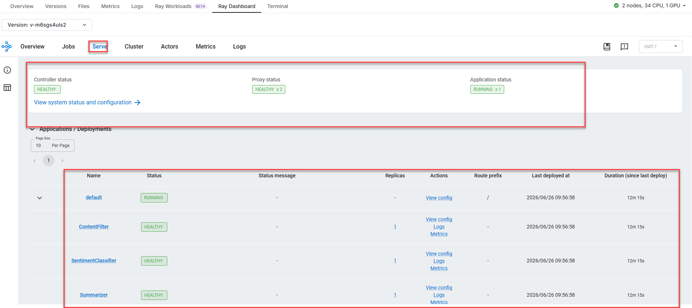

## 5.5 — View Per-Application Metrics

Scroll to the **Metrics** section of the Ray Dashboard (or click **Metrics** on a
deployment) to see per-application charts:

- **QPS per application**
- **Error QPS per application**
- **P90 latency per application**

Use **VIEW IN GRAFANA** and the refresh interval / time-range controls to drill in.

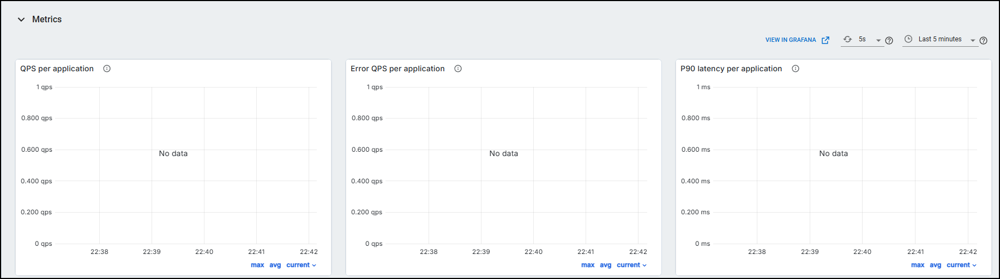

## 5.6 — Inspect Serve Controller Logs

For troubleshooting, open the **Logs** view and select the **Controller** component.
Here you can confirm the controller started, the proxy is listening, applications were
imported and built successfully, and deployments registered their autoscaling state.
Use the keyword filter, time range, or **Download log file** for deeper investigation.

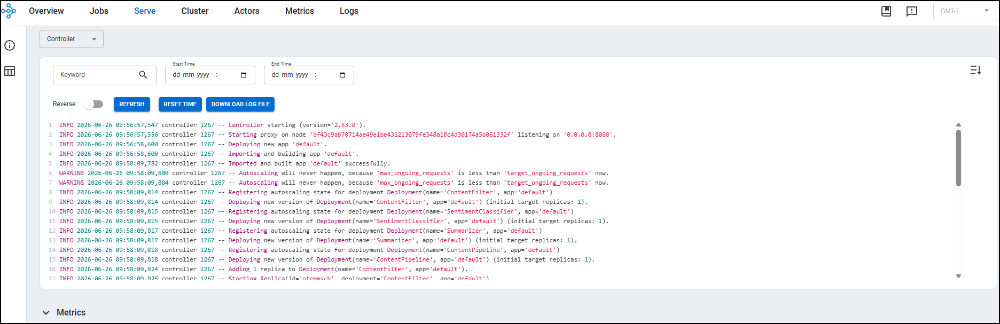

---

## Validation Checklist

Your environment is healthy when:

- [ ] The **Metrics → Service** view shows the expected number of replicas.
- [ ] **Cluster Utilization** (GRAM / RAM) is within normal limits and **Ray OOM Kills**
      shows no data.
- [ ] The **Ray Dashboard → Serve** view shows Controller, Proxy, and Application as
      HEALTHY / RUNNING.
- [ ] All deployments report HEALTHY with their target replica counts.
- [ ] **Controller logs** show no recurring errors.

---

## Quick Reference

| Resource | URL |
|---|---|
| Anyscale Console | [https://console.anyscale.com](https://console.anyscale.com) |
| Anyscale Docs | [https://docs.anyscale.com](https://docs.anyscale.com) |
| Workspaces Docs | [https://docs.anyscale.com/platform/workspaces](https://docs.anyscale.com/platform/workspaces) |
| Clouds Docs | [https://docs.anyscale.com/admin/cloud](https://docs.anyscale.com/admin/cloud) |

## Support Contact

The CloudLabs support team is available 24/7, 365 days a year, via email and live chat to ensure seamless assistance at any time. We offer dedicated support channels tailored specifically for both learners and instructors, ensuring that all your needs are promptly and efficiently addressed.

Learner Support Contacts:

- Email Support: [cloudlabs-support@spektrasystems.com](mailto:cloudlabs-support@spektrasystems.com)
- Live Chat Support: https://cloudlabs.ai/labs-support

Click **Next** from the bottom right corner to embark on your Lab journey!

Now you're all set to explore the powerful world of technology. Feel free to reach out if you have any questions along the way. Enjoy your workshop!
