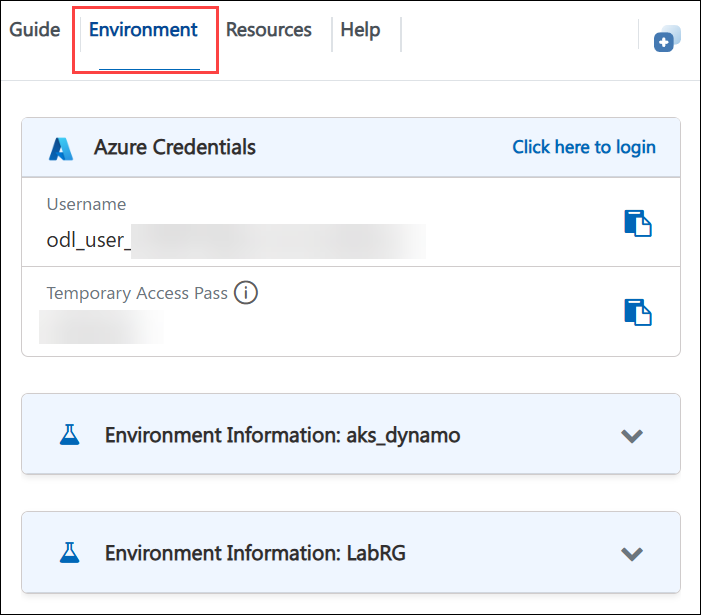
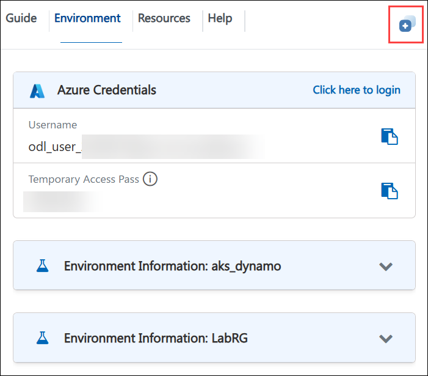
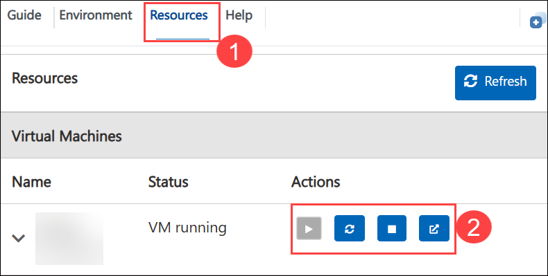
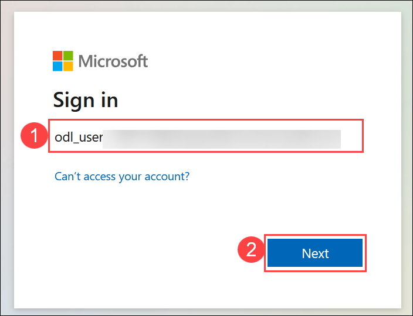
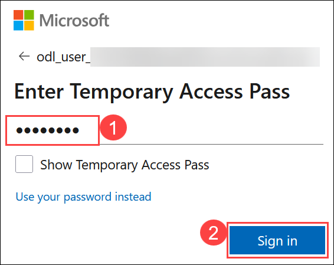
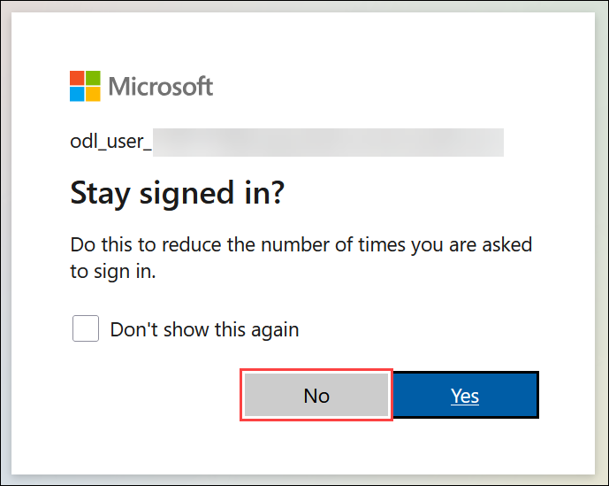

## Dynamo On AKS

### Overall Estimated Duration: 4 Hours

## 📘 Lab Scenarios

Your organization is building a production-scale AI platform to serve large language models (LLMs), reasoning models, multimodal applications, and video generation workloads across multiple GPU nodes. As demand increases, the existing inference deployment experiences higher latency, inefficient resource utilization, and limited scalability.

To overcome these challenges, your team has decided to implement **Dynamo**, an open-source, datacenter-scale inference orchestration layer. **Dynamo** works alongside inference engines such as SGLang, TensorRT-LLM, and vLLM, coordinating them into a unified multi-node inference system. By enabling disaggregated serving, intelligent request routing, multi-tier KV caching, and automatic scaling, the platform delivers higher throughput while minimizing latency for AI inference workloads.

## 📖 Overview

**Dynamo** is an open-source inference orchestration framework designed to simplify the deployment and management of large-scale AI inference workloads across distributed GPU infrastructure. Rather than replacing inference engines such as SGLang, TensorRT-LLM, or vLLM, Dynamo coordinates them into a unified multi-node inference system. Built with Rust for high-performance execution and Python for extensibility, it provides capabilities including disaggregated serving, intelligent request routing, multi-tier KV caching, and automatic scaling. These features enable organizations to efficiently serve LLM, reasoning, multimodal, and video generation models while optimizing throughput, minimizing latency, and improving overall resource utilization.

## 🎯 Objectives

In this lab, you will deploy and configure Dynamo, an open-source, datacenter-scale inference orchestration layer, to build a scalable and efficient AI inference platform. You will integrate Dynamo with a supported inference engine, configure distributed inference capabilities, and explore features such as disaggregated serving, intelligent request routing, multi-tier KV caching, and automatic scaling. By the end of the lab, you will validate the deployment and understand how Dynamo orchestrates multiple inference engines to maximize throughput, improve resource utilization, and reduce latency for large-scale AI workloads.

## ⚙️ Pre-requisites

Participants should have:

## 🏗️ Architecture

## 🖼️ Architecture Diagram

### 🔍 Explanation of Components

## 🚀 Getting Started with the lab

Welcome to your **Dynamo on AKS** Workshop. Let's begin by making the most of this experience:

## Accessing Your Lab Environment

Once you're ready to dive in, your virtual machine and **Guide** will be right at your fingertips within your web browser.

> **Note:** **If you see a PowerShell window running, please minimize it after accessing the environment to ensure the script continues to run in the background without interruption.**

### Virtual Machine & Lab Guide

Your virtual machine is your workhorse throughout the workshop. The lab guide is your roadmap to success.

## Exploring Your Lab Resources

To get a better understanding of your lab resources and credentials, navigate to the **Environment** tab.

## Utilizing the Split Window Feature

For convenience, you can open the lab guide in a separate window by selecting the **Split Window** button from the top right corner.

## Managing Your Virtual Machine

Feel free to **Start, Stop, or Restart (2)** your virtual machine as needed from the **Resources (1)** tab. Your experience is in your hands!

## Lab Guide Zoom In/Zoom Out

To adjust the zoom level for the environment page, click the **A↕** icon located next to the timer in the lab environment.

## Resize the Virtual Machine View

Use the **slider (three vertical dots)** located between the **Virtual Machine** and the **Lab Guide** panes to adjust the display size, allowing you to customize the layout based on your preference.

## Let's Get Started with Azure Portal

1. On your virtual machine, click on the Azure Portal icon.

   

2. On the **Sign in to Microsoft Azure** tab, enter the following **email/username (1)**, and click on **Next (2)**. 

   - **Email/Username:** <inject key="AzureAdUserEmail"></inject>

     

3. Now enter the following **Temporary Access Pass (1)** and click on **Sign in (2)**.

   - **Temporary Access Pass:** <inject key="AzureAdUserPassword"></inject>

     

4. If prompted to **stay signed in**, you can click **No**.

   

## 📞 Support Contact

The CloudLabs support team is available 24/7, 365 days a year, via email and live chat to ensure seamless assistance at any time. We offer dedicated support channels tailored specifically for both learners and instructors, ensuring that all your needs are promptly and efficiently addressed.

Learner Support Contacts:

- Email Support: [cloudlabs-support@spektrasystems.com](mailto:cloudlabs-support@spektrasystems.com)
- Live Chat Support: https://cloudlabs.ai/labs-support

Click **Next >>** from the bottom right corner to embark on your Lab journey!

Now you're all set to explore the powerful world of technology. Feel free to reach out if you have any questions along the way. Enjoy your workshop!

## Happy Learning!!
